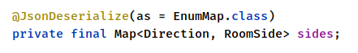
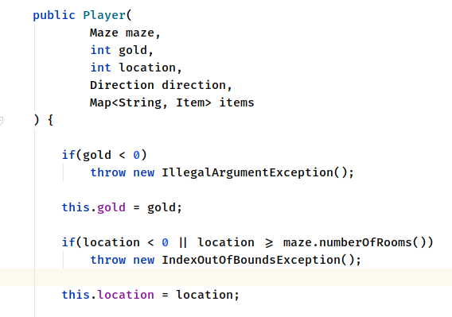
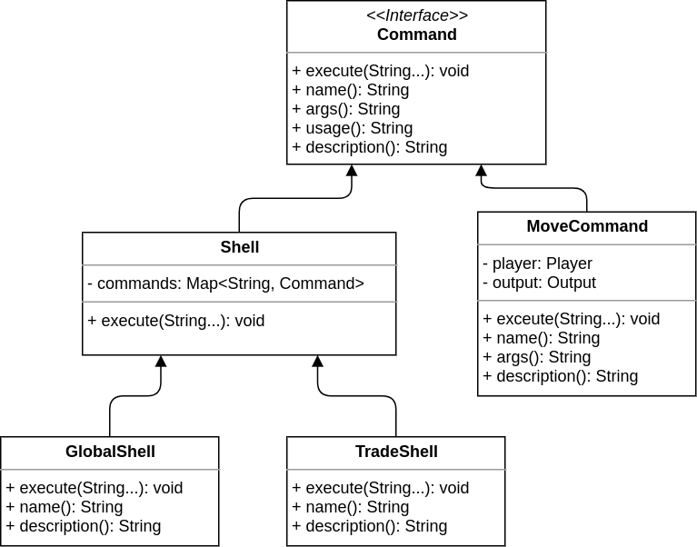
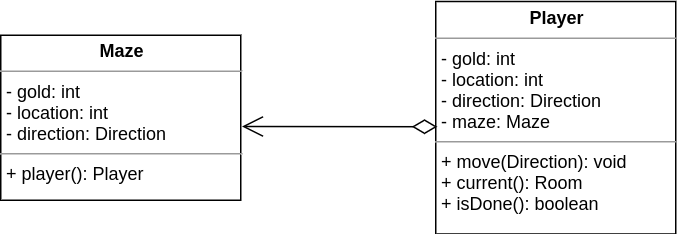
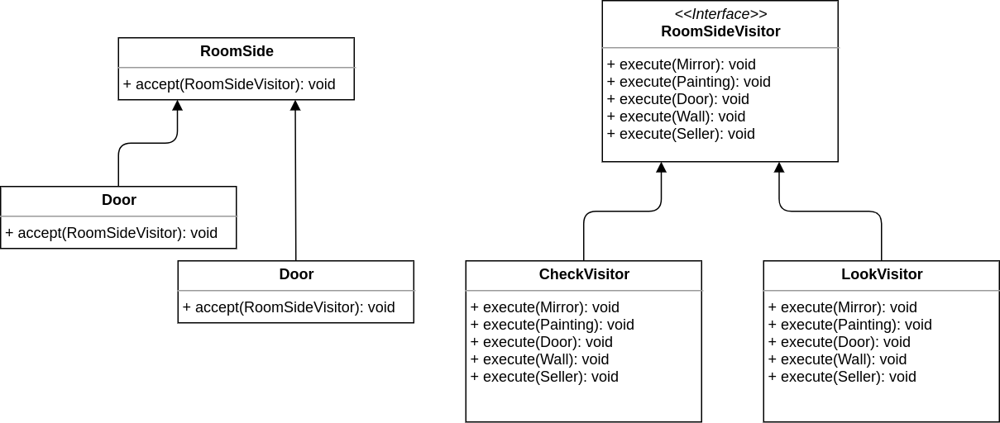
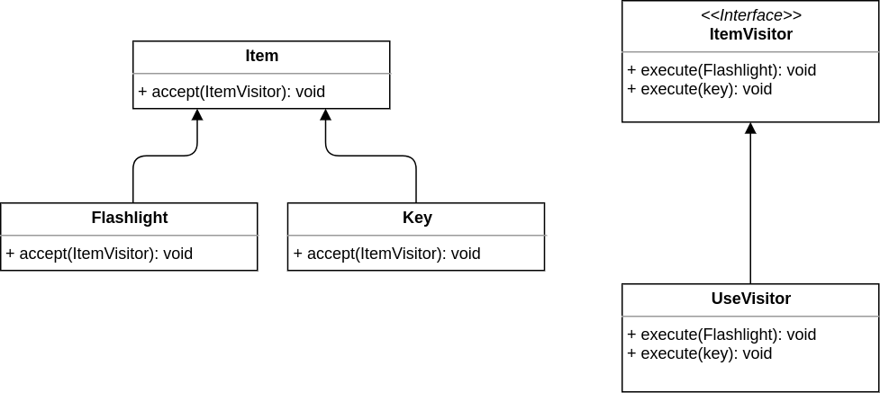
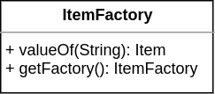

# Effective Java


## Item 9: Prefer Try-With-Resources To Try-Finally

**Try-With-Resources** is used by the `GameLoader` when loading the maze file.
And as the book stated it's shorter, more readable, 
better handles closing resources and provides far better diagnostics.

## Item 10: Obey The General Contract When Overriding Equals

In `Key` item implementation I needed to override the equals 
method as not all keys are the same like the `Flashlight` item
every key is identified by it's color.

The implementation is auto generated by intellij so no need to make tests for it.

The signature have the `Override` annotation to make sure we 
are implementing the right method. 
```
@Override
public boolean equals(Object o) {
    if (this == o) return true;
    if (o == null || getClass() != o.getClass()) return false;
    Key key = (Key) o;
    return color.equals(key.color);
}
```

## Item 11: Always Override Hashcode When You Override Equals

I also override the hashCode method for the `Key` class as the book says, 
because not doing so violates the `hashCode` contract.

```
@Override
public int hashCode() {
    return Objects.hash(color);
}
```


## Item 12: Always override toString

I used the `toString` method in the `Item` subclasses to make 
the items have a string representation and this representation 
can be used to reconstruct the item using the `ItemFactory` that takes a string
gives back an appropriate item instance and following the book's advice a documented for each `Item` subclass the format 
which this class is using.

For example `Key` class `toString`:

```
/**
 * The string format that this method returns is
 * "color key" where color is substituted by the key's color.
 *
 * @return string representation of the key.
 */
@Override
public String toString() {
    return color + " key";
}
```

and I made it required to implement a `toString` for 
each new subclass of the `Item` class by making it abstract.

 
I also override it in the `RoomSide` subclasses 
to return the type as I think it's good for using it to output messages 
to the player in the commands.

## Item 17: Minimize Mutability

Some immutable classes in the project are `Key`, `Wall` and `Seller`.

Any class that are not immutable I minimized the mutability as much as I can
for example in `Room` class the sides map can't be accessed outside the class
but made `getSide` method to access it. 

In the `Seller` class the prices map is unmodifiable, so it's fine to
return access to it by the `getPrices` method.

## Item 19: Design And Document For Inheritance Or Else Prohibit It

The classes that are designed for inheritance in the project are
`Item`, `RoomSide` and `Shell` classes.

In the `Item` class it's made clear that the `toString` method 
must be overridden and what to be expected from it.

```
/**
 * This method made is abstract to make all items
 * have a description and every item must have a format
 * for the description that is enough to reconstruct the item from it
 *
 * @return The description of the item
 */
@Override
public abstract String toString();
```

The `Shell` class also is designed to inherited.

Here is made a comment on how the method is used in the class.

```
/**
 * Used by the while loop in the execute method of the shell.
 *
 * @return true if the shell must stop.
 */
public boolean done() {
    return done;
}
```

Any class that is not design for inheritance I made it `final`

for example `Key`, `Flashlight`, `Door` and `Chest` to name a few. 
and in the future I want a class to be inherited I can remove the final
keyword and make the nessesary changes.

This better than allowing it in the first place as it can be abused.

## Item 23: Prefer class hierarchies to tagged classes

Class hierarchies I made in the project are `RoomSide` and `Item` classes.

This way the code is clean, short and can be easily extensible. 

## Item 24: Favor static member classes over nonstatic

I used inner classes in `Shell`, `UseCommand`, `LookCommand` and `CheckCommand` classes.

I didn't put them as static because they need to access the enclosing instance.

## Item 25: Limit source files to a single top-level class

This item is followed by all files in the project.

## Item 26: Don’t use raw types

Raw types are never used in the project.

Because generics provide a good protection at compile time, this way you can prevent bugs
from happening or find them earlier.

## Item 34: Use enums instead of int constants

I used `Direction` enum to define directions in the maze.

making directions enum is more powerful, you can assign 
different behavior with each enum constant.

In the `Direction` enum I assigned three behaviors `left`, `right` and `reverse`.

This also makes the code cleaner and more robust.

## Item 37: Use EnumMap instead of ordinal indexing  

Used in the `Room` implementation to store the room sides.



## Item 40: Consistently use the Override annotation

using this can prevent hidden bugs like when overriding `equals` method.

## Item 49: Check parameters for validity

In the `Player` class constructor.



`Objects.requireNonNull` is used when ever appropriate.

## Item 53: Use varargs judiciously

I used `varagrs` in `Command` interface and according to the book 
it's safe as the signature didn't declare a generic type. 

## Item 55: Return optionals judiciously

In the `HiddenItem` interface the `getItem` method returns 
an `Optional<Item>` because it's Ok to not have a hidden item and
making the method returns `Optional` enforces that.

 

# Clean Code

## Use Intention-Revealing Names

For example the `Openable` interface the name implies that the 
object can be open or closed, and it's applied to the door and the chest

```
public interface Openable {
    void open();
    boolean isOpen();
    boolean lock(Item key);
    boolean unlock(Item key);
    boolean isUnlocked();
    Key getKey();
}
```

And each method has a clear name defining what it does.

# Design Patterns

## Composite Pattern

Defining the commands hierarchy where a simple command is a leaf
and the shell is a composite.

Each shell has a list of commands that are related to the giving shell
and a shell can have another shell in the list of it's commands.



## Iterator Pattern

Defining the relation between the maze and the player.

That is the player is an iterator of the maze.

By making the player an iterator you can have more than player
for the same maze and the you don't have to give 
the maze instance with the player instance. 



## Visitor Pattern

This pattern is used in the `check`, `look` and `use` commands as these
commands deals with each type differently.



and visitor for the items



## Abstract Factory Pattern

This pattern is used in `ItemFactory` class.

The class is implemented using a factory method `valueOf`
which takes a `String` that represents the item description following
the item description format described in its `toString()` method 
and returns the matching `Item` object.

And the class is a Singleton as one factory is needed.



## Singleton Pattern

This pattern is used in the `ItemFactory` and the `GameLoader`

as we need one object from these classes and global access to them.


# SOLID Principles

## Single-Responsibility Principle

For example the `Player` class has a responsibility to store the state of the player.

And making the player is the responsibility of the `Maze` class as the player is an iterator
of the maze.

## Open-Closed Principle

`Command` hierarchy follows this principle that you can add commands and shell without
affecting other commands.

`RoomSide` hierarchy you can also add subclasses without affecting others, but because
I used the Visitor pattern each visitor must add another method to handle the new subclass
this is reasonably fine because when you add new subclasses you need to handle then anyway

Because the player is expecting something when they run the command that uses a visitor like
`CheckCommand`. 

## Liskov substitution principle

In the `Command` interface and the `Shell` 

The `Shell` class is a substitutable of `Command` interface, and this is proofed because
in the shells commads list can have concrete commands like `UseCommand` or it can be a `Shell`
like the `TradeShell` in the `GlobalShell`.

## Interface segregation principle

Based on this principle I made `Openable` and `HiddenItem` interfaces
because not all `RoomSide` subclasses are openable like the `Chest`
and `Door` classes, and not all subclasses have hidden items like 
`Painting` and `Mirror`,

## Dependency Inversion principle

For example in the `Shell` class it depends on the `Input`, `Output`, `Command` and
`Map` interfaces, and these are abstractions.

And when ever I need a list or a map I define them by their interfaces `List` and `Map`.

# Data Structures

In `Shell` class I used a Map to store the commands, where the command
name is the key and the command itself is the value, I used the Map
because it's fast and I need to query the commands by the name as 
the name is unique.

I used a `LinkedHashMap` implementation in the 
subclasses of `Sell` to make the commands order
be the same as the insertion order, because if the order 
of the commands keeps changing the player will take longer
 to find the commands thay are looking for.

In the `Room` class is used an `EnumMap` is it's more efficient than
`HashMap`.

In `Maze` class I used a `List` to store the rooms, because a maze
is a list of rooms and the each room is identified by it's index 
in the list.

In `Player` class I used a `Map` to store the items, I used a map instead
of a `List` is because items have a description and when the game user
query them they use the item description, so it's faster to store them
in a map instead of a list and because not all items are immutable, 
but their description is.

In the `Seller` class a `Map` is used to map an item description
to a price, and when the player buys or sells an item the description
is used to create the item using the `ItemFactory`.

In the `Chest` class I used a list of items, I didn't use the item description
because the items in the chest are going to be collected once so
it is safe to store the actual item.


# Style Guide

In this project I used [Google style guide](https://google.github.io/styleguide/javaguide.html)

## File encoding: UTF-8

This is made clear in the pom.xml file

```xml
<project.build.sourceEncoding>UTF-8</project.build.sourceEncoding>
```

## Horizontal alignment: never required

I didn't use this as it's not required and in the clean code book
stated that it's not a good idea.